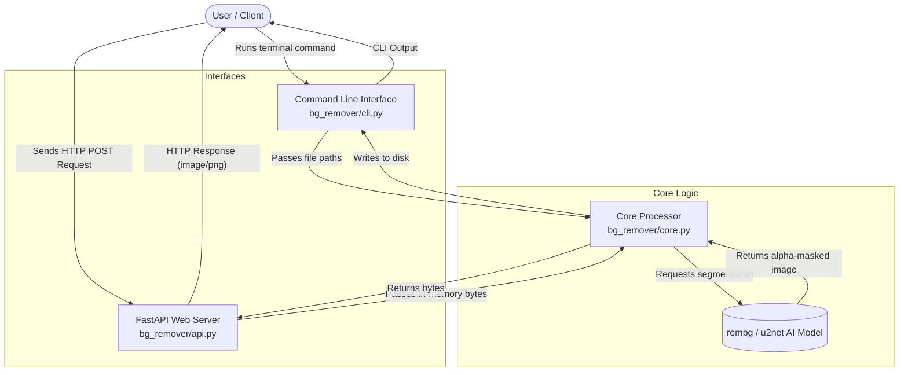

# System Architecture

This document describes the architectural layout of the Image Background Remover project. The codebase is designed to be modular, separating the core artificial intelligence logic from the interfaces that interact with the user (CLI and API).

## Directory Structure

```
Image background remover/
├── bg_remover/
│   ├── __init__.py     # Marks the directory as a Python package
│   ├── core.py         # The heart of the application; interacts with AI models
│   ├── cli.py          # The command-line interface wrapper
│   └── api.py          # The FastAPI web server wrapper
├── docs/               # All documentation files
├── setup.py            # Python package configuration
├── requirements.txt    # Project dependencies
└── Dockerfile          # Containerization configuration
```

## Component Breakdown

### 1. The Core Layer (`core.py`)
This layer handles the actual image processing. It imports the `rembg` library, which utilizes the `u2net` (U-Net) deep learning architecture specifically trained to detect salient objects in images and generate alpha masks (transparency) for backgrounds. 
- It works directly with raw byte streams to maximize performance and minimize disk I/O when processing in-memory data (like API uploads).

### 2. The CLI Layer (`cli.py`)
This component uses Python's built-in `argparse` to provide a terminal interface.
- It parses user inputs (flags like `--input` and `--output`).
- It determines whether the input is a single file or a directory.
- It passes the file paths down to the Core layer for processing.

### 3. The API Layer (`api.py`)
This component uses `FastAPI` to expose the core logic over HTTP.
- It handles incoming `multipart/form-data` requests.
- It reads the uploaded file directly into memory as a byte stream.
- It passes the bytes to the Core layer, avoiding the need to save the file to the disk temporarily.
- It returns the processed image bytes directly in the HTTP response.

## Data Flow Diagram


